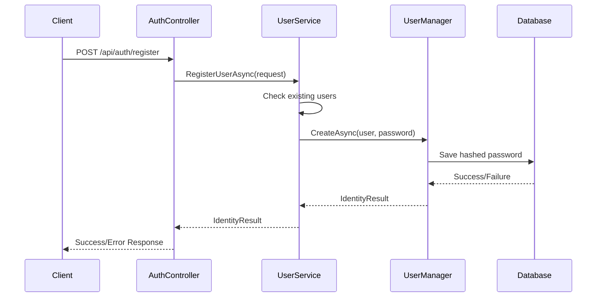
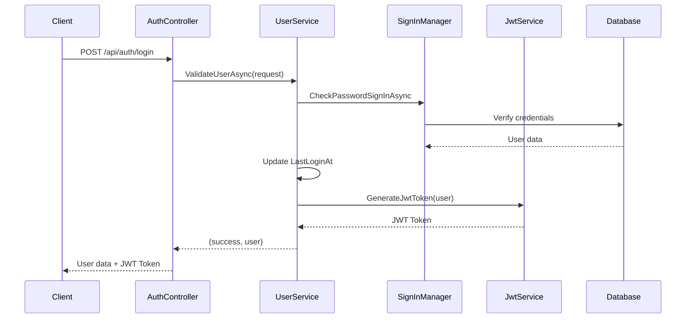
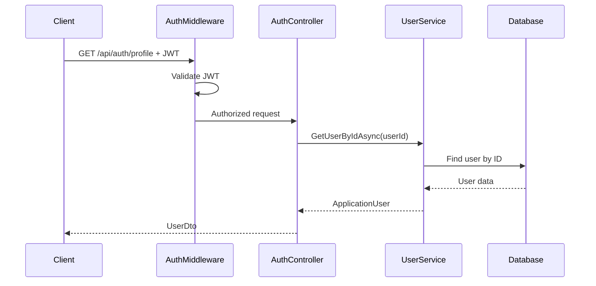

# Code Architecture Documentation

This document provides a comprehensive overview of the codebase architecture, design patterns, and implementation details for the Login and Registration Backend.

## 🏗️ Architecture Overview

### High-Level Architecture

```
┌─────────────────┐    ┌─────────────────┐    ┌─────────────────┐
│   Controllers   │────│    Services     │────│      Data       │
│                 │    │                 │    │                 │
│ - AuthController│    │ - UserService   │    │ - DbContext     │
│   (API Layer)   │    │ - JwtService    │    │ - Models        │
│                 │    │ (Business Logic)│    │ (Data Layer)    │
└─────────────────┘    └─────────────────┘    └─────────────────┘
         │                       │                       │
         └───────────────────────┼───────────────────────┘
                                 │
                    ┌─────────────────┐
                    │   ASP.NET Core  │
                    │   Identity +    │
                    │   Entity        │
                    │   Framework     │
                    └─────────────────┘
```

### Design Patterns Used

1. **Dependency Injection**: Services are injected into controllers
2. **Repository Pattern**: Entity Framework acts as repository layer
3. **Service Layer Pattern**: Business logic separated into services
4. **DTO Pattern**: Data Transfer Objects for API communication
5. **Options Pattern**: Configuration through appsettings.json

## 📁 Project Structure Analysis

### `/Controllers`
Contains API endpoints and HTTP request/response handling.

**AuthController.cs**
- **Purpose**: Handles all authentication-related HTTP requests
- **Dependencies**: `IUserService`
- **Responsibilities**:
  - Request validation
  - HTTP response formatting
  - Exception handling
  - Authorization attribute enforcement

### `/Services`
Contains business logic and application services.

**IUserService.cs / UserService.cs**
- **Purpose**: User management and authentication business logic
- **Dependencies**: `UserManager<ApplicationUser>`, `SignInManager<ApplicationUser>`, `IJwtService`, `ApplicationDbContext`
- **Responsibilities**:
  - User registration and validation
  - Password verification
  - User retrieval operations
  - JWT token generation coordination

**IJwtService.cs / JwtService.cs**
- **Purpose**: JWT token operations
- **Dependencies**: `IConfiguration`
- **Responsibilities**:
  - Token generation with claims
  - Token validation and parsing
  - Security key management

### `/Models`
Contains data models and DTOs.

**ApplicationUser.cs**
- **Purpose**: Extended user entity inheriting from IdentityUser
- **Properties**: `CreatedAt`, `LastLoginAt`
- **Features**: Tracks user creation and last login timestamps

**User.cs**
- **Purpose**: DTOs for API communication
- **Classes**: `UserDto`, `RegisterRequest`, `LoginRequest`
- **Usage**: Request/response data transfer

### `/Data`
Contains database context and configuration.

**ApplicationDbContext.cs**
- **Purpose**: Entity Framework database context
- **Inheritance**: `IdentityDbContext<ApplicationUser>`
- **Configuration**: Unique constraints on username and email

## 🔧 Technical Implementation Details

### Dependency Injection Configuration

**Program.cs - Service Registration:**
```csharp
// Identity Services
builder.Services.AddIdentity<ApplicationUser, IdentityRole>(options => { ... })
    .AddEntityFrameworkStores<ApplicationDbContext>()
    .AddDefaultTokenProviders();

// Custom Services
builder.Services.AddScoped<IJwtService, JwtService>();
builder.Services.AddScoped<IUserService, UserService>();

// Database Context
builder.Services.AddDbContext<ApplicationDbContext>(options =>
    options.UseSqlite(builder.Configuration.GetConnectionString("DefaultConnection"))
);
```

### Authentication Pipeline

**Authentication Flow:**
1. **JWT Bearer Authentication** as primary scheme
2. **Cookie Authentication** for OAuth flows
3. **Google OAuth** provider (configured but requires credentials)
4. **Microsoft OAuth** provider (configured but requires credentials)

**Configuration Details:**
```csharp
builder.Services.AddAuthentication(options =>
{
    options.DefaultAuthenticateScheme = JwtBearerDefaults.AuthenticationScheme;
    options.DefaultChallengeScheme = JwtBearerDefaults.AuthenticationScheme;
})
.AddJwtBearer(options => { ... })
.AddGoogle(options => { ... })
.AddMicrosoftAccount(options => { ... });
```

### Database Design

**Entity Relationships:**
- `ApplicationUser` extends `IdentityUser`
- ASP.NET Core Identity tables automatically created
- Unique constraints enforced on `UserName` and `Email`

**Migration Strategy:**
- Entity Framework Code First approach
- Database auto-created on application startup
- Migrations stored in `/Migrations` folder

### Security Implementation

**Password Security:**
- ASP.NET Core Identity password hashing
- Configurable password complexity requirements
- Secure password verification using `PasswordHasher`

**JWT Security:**
- HMAC SHA256 signature algorithm
- Configurable expiration (default: 7 days)
- Claims-based authorization
- Secure key storage in configuration

**CORS Security:**
- Configurable allowed origins
- Credentials support for authenticated requests
- Header and method restrictions

## 🔄 Data Flow Analysis

### User Registration Flow



### User Login Flow



### Protected Endpoint Access



## 🏛️ Service Layer Details

### UserService Implementation

**Key Methods:**
- `RegisterUserAsync`: Creates new user with validation
- `ValidateUserAsync`: Authenticates user credentials
- `GetUserByIdAsync/GetUserByEmailAsync/GetUserByUsernameAsync`: User retrieval
- `GenerateJwtToken`: Delegates to JwtService
- `HashPassword/VerifyPassword`: Password security operations

**Error Handling:**
- Uses ASP.NET Core Identity `IdentityResult` for operation results
- Returns tuple `(bool Success, ApplicationUser? User)` for validation
- Null-safe operations with nullable return types

### JwtService Implementation

**Token Generation Process:**
1. Create claims from user data
2. Configure token descriptor with expiration and security
3. Generate signed token using security key
4. Return serialized token string

**Token Validation Process:**
1. Parse token using security key
2. Validate issuer, audience, lifetime, and signature
3. Return `ClaimsPrincipal` for authorized access
4. Return null for invalid tokens

## 🔒 Security Architecture

### Authentication Layers

1. **JWT Bearer Token Validation**
   - Validates token signature and claims
   - Checks token expiration
   - Verifies issuer and audience

2. **ASP.NET Core Identity**
   - Manages user accounts and passwords
   - Provides secure password hashing
   - Handles user validation and account management

3. **Authorization Attributes**
   - `[Authorize]` attribute on protected endpoints
   - Claims-based authorization using JWT claims

### Security Best Practices Implemented

- **Password Hashing**: Using ASP.NET Core Identity's secure hashing
- **SQL Injection Prevention**: Entity Framework parameterized queries
- **XSS Protection**: JSON serialization escapes dangerous characters
- **CORS Configuration**: Restricted to specific origins
- **HTTPS Redirection**: Enforced in production pipeline
- **Secret Management**: Configuration-based key storage

## 🧪 Testing Considerations

### Testable Architecture

**Dependency Injection Benefits:**
- Services can be mocked for unit testing
- Controllers have minimal dependencies
- Business logic separated from HTTP concerns

**Service Layer Testing:**
- `UserService` methods can be unit tested
- `JwtService` token generation/validation testable
- Mock `UserManager` and `SignInManager` for isolation

**Integration Testing Opportunities:**
- Full authentication flow testing
- Database integration testing with test database
- API endpoint testing with `TestServer`

### Current Testing Gaps

- No unit tests implemented yet
- No integration tests for authentication flow
- No API endpoint testing suite
- No performance testing

## 🚀 Performance Considerations

### Database Performance

**Optimizations:**
- Unique indexes on `UserName` and `Email`
- Entity Framework change tracking
- Async operations throughout

**Potential Improvements:**
- Connection pooling configuration
- Query optimization for user lookups
- Database migration to production RDBMS

### Caching Opportunities

**Current State**: No caching implemented

**Potential Caching:**
- JWT token validation results (short-term)
- User profile data (with invalidation)
- Configuration values (startup caching)

### Scalability Considerations

**Current Limitations:**
- SQLite not suitable for production scale
- No horizontal scaling considerations
- Single-instance JWT validation

**Scaling Solutions:**
- Production database (PostgreSQL/SQL Server)
- Redis for distributed caching
- JWT validation caching
- Load balancing considerations

## 🔮 Extension Points

### Adding New Features

**Role-Based Authorization:**
- Extend `ApplicationUser` with roles
- Add role claims to JWT tokens
- Implement role-based `[Authorize]` attributes

**Email Verification:**
- Extend registration flow
- Add email confirmation endpoints
- Integrate email service

**Two-Factor Authentication:**
- Leverage Identity's 2FA features
- Add TOTP/SMS verification
- Extend login flow

**Refresh Tokens:**
- Implement refresh token model
- Add token refresh endpoint
- Manage token lifecycle

### Integration Points

**External Services:**
- Email service integration (SendGrid, SMTP)
- SMS service for 2FA
- Logging service (Serilog, Application Insights)
- Monitoring and metrics

**Frontend Integration:**
- CORS configuration for production
- API versioning strategy
- OpenAPI documentation enhancement

## 📊 Code Quality Metrics

### Current State

**Strengths:**
- Clear separation of concerns
- Consistent naming conventions
- Proper use of async/await
- Interface-based abstractions

**Areas for Improvement:**
- Missing XML documentation
- No unit test coverage
- Limited error logging
- No performance monitoring

### Code Organization

**File Organization**: Logical grouping by functionality
**Namespace Strategy**: Consistent with folder structure
**Dependency Management**: Clean dependency chains
**Configuration Management**: Centralized in appsettings.json

This architecture provides a solid foundation for a production authentication system while maintaining flexibility for future enhancements and scaling requirements.
